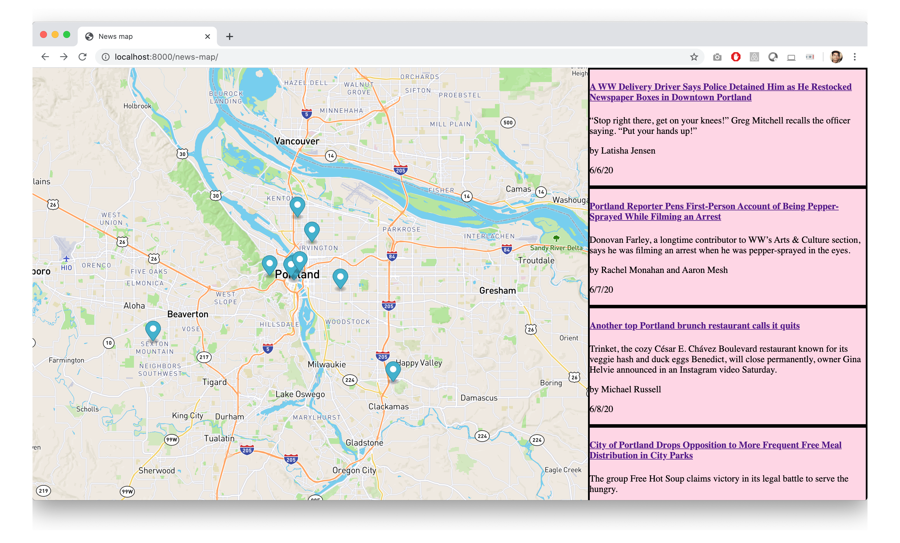

# News map

#### Front page stories from the New York Times, geo-tagged and displayed on a map.

### To do
- [x] Create layout
- [x] Add map
- [x] Add dummy stories
- [x] Add JavaScript object to project
- [x] Add pins to map
- [x] Add stories to page
- [x] Design story card
- [x] Connect stories to pins
    - [x] Click on pin and highlight the story
    - [x] Click the story and center the map on the pin
- [ ] Figure out how to get news stories and add location
- [ ] Figure out how to do this automatically every day, from different news sources
- [ ] Working site for Portland, then try to do it for other locations
- [ ] Add geocoder to map
- [x] Mobile friendly design
  - [x] 60% map/40% story
  - [x] Stories scroll horizontally
  - [x] Hide the blurb
- [ ] Tests
- [x] Test branch

#### June 06, 2020

#### June 07, 2020

#### June 08, 2020
Created a CSV with 10 stories, converted it to GeoJSON, and used Fetch to read it as an object. Now I can define a binding and point it to this object.

#### June 12, 2020
Ended up not defining a binding. Used `forEach` to add the coordinates to the map.

#### June 13, 2020
The stories and pins now populate from the JSON file. The `createStory` function first adds a pin to the map based off of the coordinates then creates a div element and sets the values for the story fields. Last, it adds the story to the side panel.

#### June 14, 2020
Updated the design of the story cards and made it so that you can scroll through them. Cleaned up the CSS file.

#### June 15, 2020
Redesigned the structure of the code. Moved pin create step back into the function where each story is being created. Added an event listener to each pin for mouseenter and mouseleave so that the corresponding story is highlighted.

#### June 23, 2020
Lots of work between now and then.

- The pin turns black when the story is selected
- A popup is tied to each pin that includes a link to the news story
- The story has a subtle indicator when the user hovers over the map pin

#### June 23, 2020
Mobile media query added so that it looks okay on smaller screens.

#### June 24, 2020
Stories in mobile view scroll sideways.

#### Final
Website requests the day's top stories from the New York Times API, creates an array with the stories that include a location name, and then requests the latitude and longitude from the Mapbox geocoding API. The JSON file is then used to create the story cards and map pins for an always up-to-date map of the top New York Times stories of the day.
