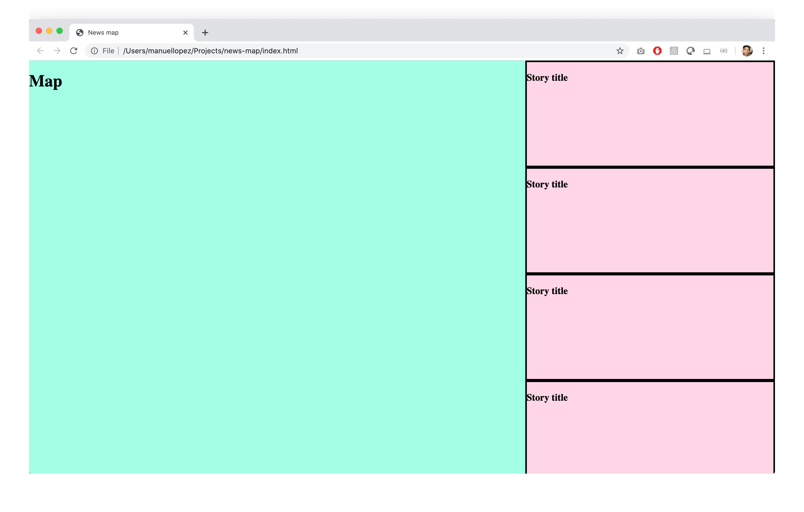
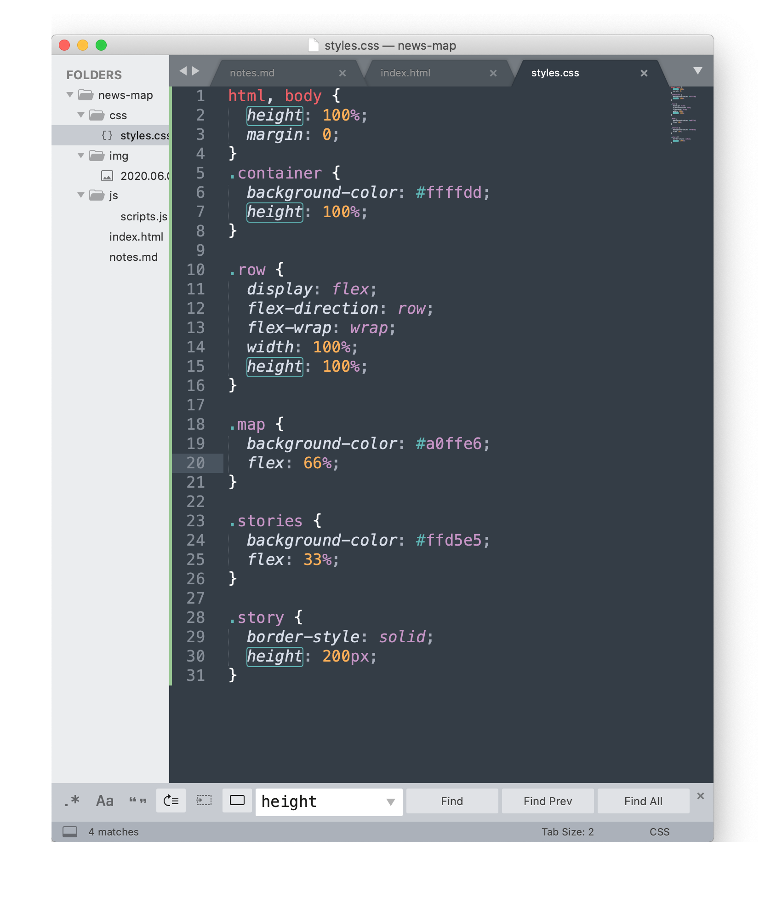
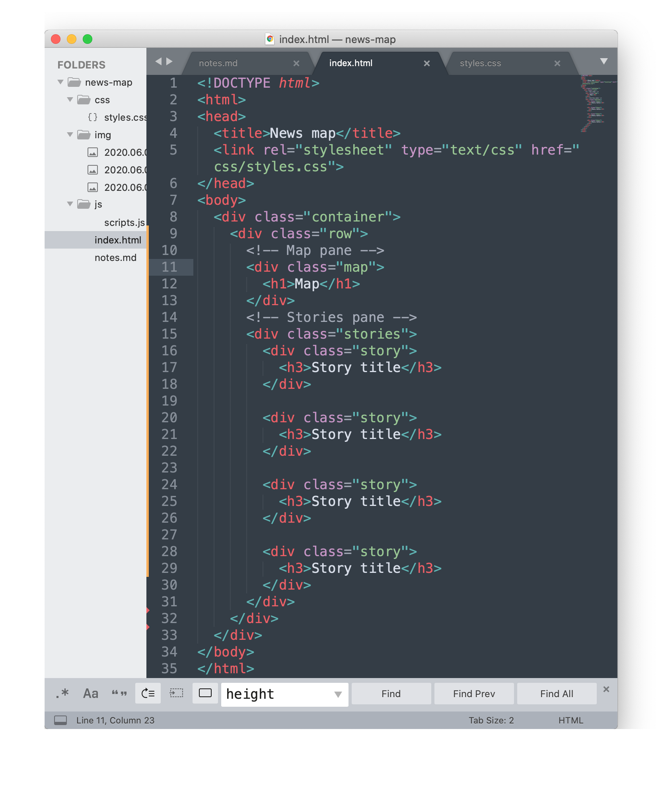

## June 06, 2020

> 2:53 PM

### Idea

A map that shows news stories around me

News stories, geo-tagged and displayed on a map

### How does it work?

##### HTML page
- Site: 2/3rds is map view, 1/3 is news story
	- Needs to load map
	- Needs location of news story
	- Needs news story

##### Data
- Database of news stories
	- Links
	- Lat/lon
- Spreadsheet? 
- How to get the data?
	- Manually
	- Scrape
	- API
	- Submissions

##### Technologies/tools
- Mapbox, for map
- Try to use vanilla JS and CSS as much as possible≤

## Work log
> 3:12 PM

I'm going to try and do this using pure CSS and JS

How do I create a two column HTML page using pure CSS? Looking into Flexbox

> 5:01 PM

Went down the flexbox rabbit hole and used the w3schools [CSS Flexbox](https://www.w3schools.com/css/css3_flexbox.asp) tutorial and [Responsive Website using Flexbox](https://www.w3schools.com/css/tryit.asp?filename=trycss3_flexbox_website2) code example.

Used flexbox to get this basic outline:

CSS using flexbox:

And the HTML for the basic outline:

> 5:23 PM

Commit to github