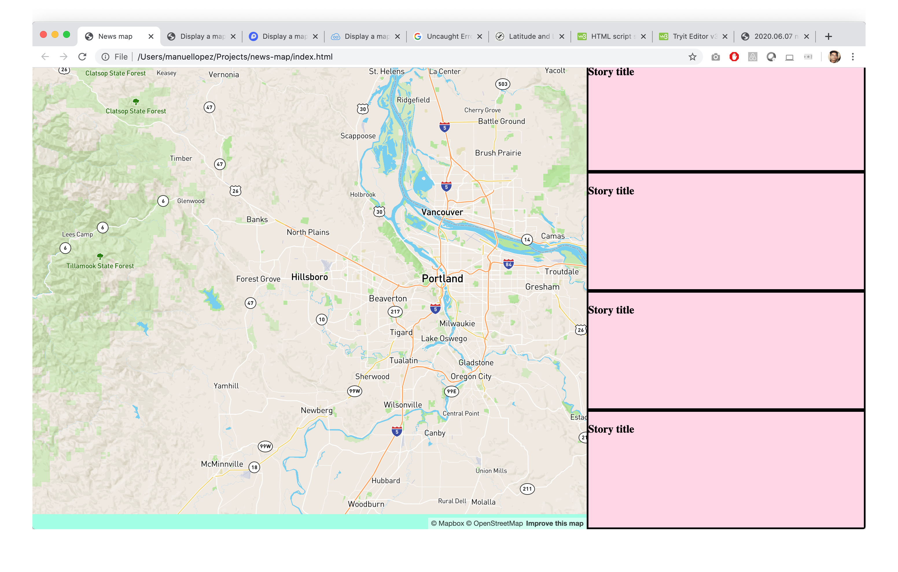
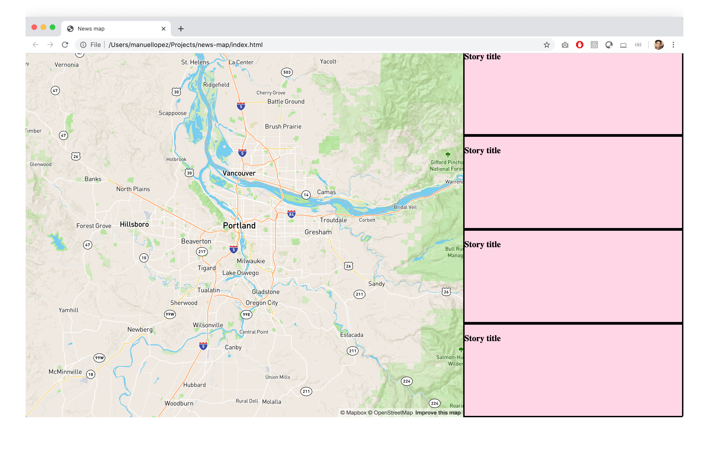

## June 07, 2020

> 3:41 PM

#### To do
- [x] Add Mapbox map

## Work log

> 3:42 PM

Open up mapbox to see how to add a map

> 4:31 PM

Used Mapbox GL JS [Display a map](https://docs.mapbox.com/mapbox-gl-js/example/simple-map/) code example. 

#### Learnings:

Need to call `<script src="js/scripts.js"></script>` at the end of the HTML file. I was creating the map before finishing loading the Stories panel. This caused the map to not be centered on Portland and for the map attribution to be off the map.

Calling `<script src="js/scripts.js"></script>` in the middle of the HTML:



Calling `<script src="js/scripts.js"></script>` at the end of the HTML, after the layout has finished loading:



#### Bug?

> 4:45 PM

The Developer console is showing an error message:

```
map.js:407 Uncaught Error: Container 'map' not found.
    at new r (map.js:407)
    at VM983 scripts.js:3
r @ worker.js:239
(anonymous) @ VM983 scripts.js:3
```