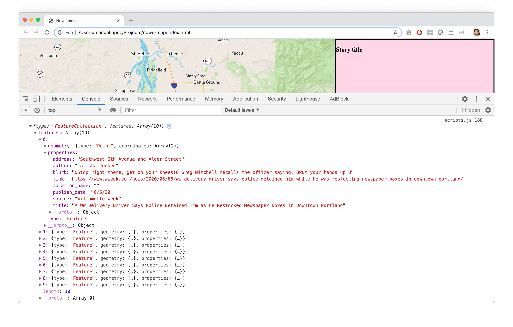

## June 08, 2020

> 2:09 PM

Time to think about how to store data. Usually, I'd go for a CSV, but I've been reading about lists, or arrays? What's a dictionary? And what is the best way to store this data so that news-map can access it? Is there an optimal way of doing this?

Resource:

- [Eloquent JavaScript](https://eloquentjavascript.net/)
	- Chapter 4: [Data Structures: Objects and Arrays](https://eloquentjavascript.net/04_data.html)

#### To do
- [x] Create CSV with 10 stories
- [ ] Read up on how to store data in JavaScript
- [x] Convert CSV into what I learned (turned it into a geojson file)

#### Work log

> 2:16 PM

Started doing research for news stories. Checking out the [Portland Mercury](https://www.portlandmercury.com/) for a list of news stories, and ran across this event: [Metallica Mondays](https://www.metallica.com/news/2020-03-27-metallica-mondays.html)!!

Metallica is posting live sets from their archives, every Monday. This is now my background music.

- [Metallica YouTube channel](https://www.youtube.com/metallica)

> 2:21 PM

What's the best way to add a file with data in your project? Created a `data` folder in my project for now.

> 2:31 PM

Read through about 10 articles so far, none really tied to a specific location. Thoughts: Not all news stories are about a specific place, so no need to map _all_ news stories. Will need to figure out a way to parse through stories and discard the ones that are about no place at all or just general Portland level stories for now. 

> 2:33 PM

How to handle stories that name a place?

Example: Justice Center

- [A Note from the Mercury’s Editor: Eyes and Hearts](https://www.portlandmercury.com/blogtown/2020/06/01/28495137/a-note-from-the-mercurys-editor-eyes-and-hearts)

	It was around 11:30 pm, and I (and at least a thousand more) had been gassed, flash-banged, and chased around the downtown corridor for hours. We had returned to the **Justice Center**, and the crowd was overwhelmingly polite.

> 2:38 PM

JSON

> 9:47 PM

Saved 10 stories in `./data/stories.csv`

> 10:14 PM

Converted to geoJSON `./data/stories.json`

> 10:19 PM

Put the geoJSON object in a variable and was able to log it to the console. Weird thing is happenning though: Whenever I use `let` to define a binding, I get an error `Uncaught SyntaxError: Identifier 'STORIES' has already been declared`. But, when I use `var` to declare the variable, I can see it in the console. What's going on?

Oh! It's becase I'm calling in the `js/scripts.js` file twice in the `index.html` file! Both at line 11 and then at line 47. The reason `var` keyword works is because of scope, I think? But `let` does not work because it has already been declared when the js file is called on line 11. 

To fix this, I'm going to only call the scripts.js file on line 47, at the end of `index.html`. If this becomes a problem (meaning that I have to run JS before line 47, I can just separate the map js and other action js)

Test:

1. Delete `js/scripts.js` from line 11
2. Use `let` to define the `STORIES` binding in the js file
3. The array should be logged in the console

> 10:32 PM

Test successfully passed!

> 10:36 PM

I want to separate the data from the JavaScript file. How can I access the STORIES binding from the data folder?

> 11:21 PM

Found MDN page for [Using Fetch](https://developer.mozilla.org/en-US/docs/Web/API/Fetch_API/Using_Fetch)

But in order to use it, I need to be serving my index.html file locally since "the files need to be served using the http or https protocols" (source: [StackOverflow](https://stackoverflow.com/questions/58128248/how-can-i-resolve-the-error-url-scheme-must-be-http-or-https-for-cors-reque))

Ran `python3 -m http.server` to run in localhost:8000 and it works!

Why did I do this? I want to keep my data separate from my JavaScript code. That means that I can update the data whenever I want and there is no JS in it. Same for my code. No data in the JS.

> 11:49 PM

Commit to GitHub