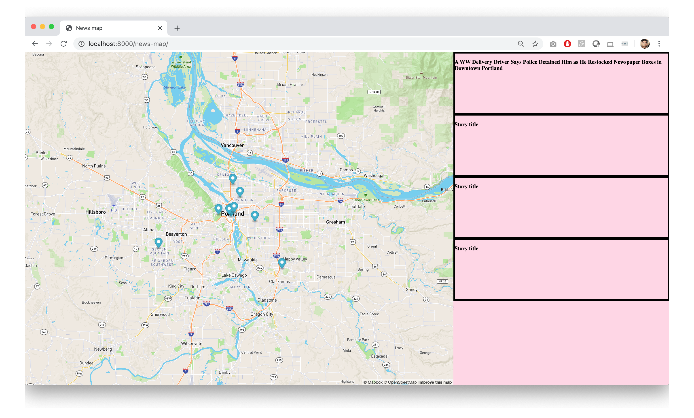

## June 13, 2020

> 3:56 PM

Was able to get a story title from the geojson into the stories pane. That unearthed some changes I need to make to how the story divs are laid out now. The story divs are hardcoded right now, but they should be created automatically based on the number of news stories. They should also be different sizes, based on the story. Some stories have longer titles, some have blurbs, etc. The pane should also scroll down to fit all of the stories. At some point maybe I need to think about pagination? How do people measure load times?

Example of the problem:

#### To do:

- [x] Create the `story` divs dynamically (not hardcoded into the HTML file)
- [x] Write createStoryDiv() function
- [x] Write forEach loop to add stories to index.html
    - [x] Create a new div
    - [x] Add class="story"
    - [x] Add to class="stories" div
    - [x] Get title, author, link, source, ...
    - [x] Add that info to div

> 7:28 PM

> 10:54 PM

Lots of work. Wrote a function to add a marker to the map and create a div for the story. The values are set wit the data from the JSON file.