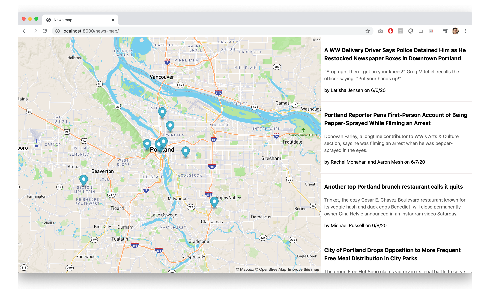

## June 14, 2020

#### To Do

- [x] Open story link in new tab
- [x] CSS
    - [x] Read up on flexbox CSS
    - [x] Fix the existing stories pane to take in stories of different sizes
    - [x] Pretty story card
    - [x] Change font

> 2:48 PM

Open link in new tab by adding `storyLink.setAttribute('target', "_blank");`

> 2:53 PM

Now that all the data is loaded into the `story` div, I can work on making it look well designed.

How do other news sites do it?

#### _The Economist_

#### _The New York Times_

#### _Portland Mercury_

#### _Willamette Week_

#### News Map today

So I can only really go up from here.

All of the titles don't look like links, so I'll remove the underline and blue text. I'll add the underline back in when the mouse hovers over the title.

> 4:03 PM

Time to learn how to use Flexbox CSS properly. Watching [Flexbox CSS In 20 Minutes
](https://www.youtube.com/watch?v=JJSoEo8JSnc). Created a new branch to rewrite my CSS file.

> 5:10 PM

Apparently there is a default 8px margin on body.

Removed a whole bunch of CSS and added `height: 100%;` and `overflow-y: scroll;` to the stories div. Finally the stories are not overflowing past the page. Instead, you can scroll through the stories.

Happy with the final result!

