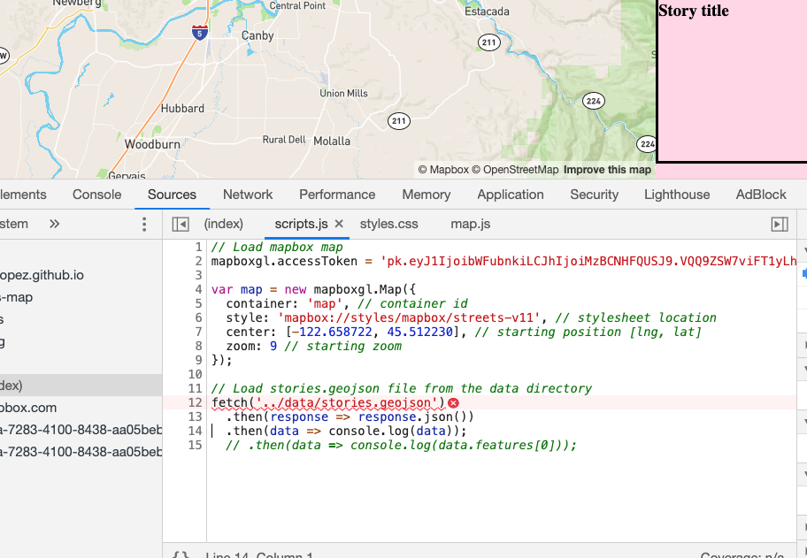

## June 09, 2020

> 9:06 PM

Last night, I pushed my code to github and Fetch was not loading the geojson file. This worked for me locally, but not on gh-pages

Spent some time with the help of a co-worker to get to the bottom of this. I was doing a couple of things wrong. 

The file that was being called by fetch was `https://mannylopez.github.io/data/stories.geojson` and not `https://mannylopez.github.io/news-map/data/stories.geojson`

This is because I was running `python3 -m http.server` _inside_ of my news-map directory. I moved it out of news-map and into my Projects directory. This acts more like what gh-pages is: `mannylopez.github.com/...` and I added `news-map/data/stories.geojson` to Fetch, and now it works.

Now, I want to figure out how to assign a variable to the geojson so that I can pull out the information, use that information to add a pin to a map, and populate the fields for the story.

### To do
- [ ] Fetch geojson
- [ ] Store latitude and longitude in an object/array
- [ ] Place pins on map with those points